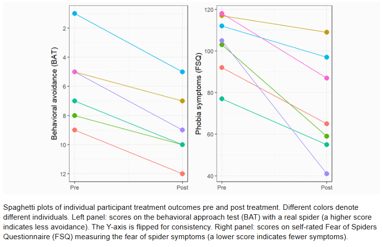
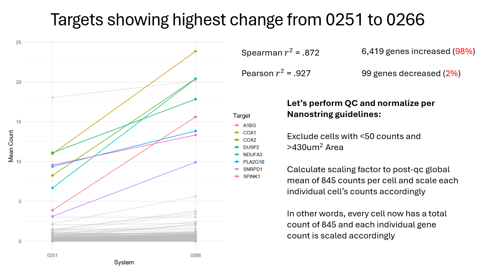
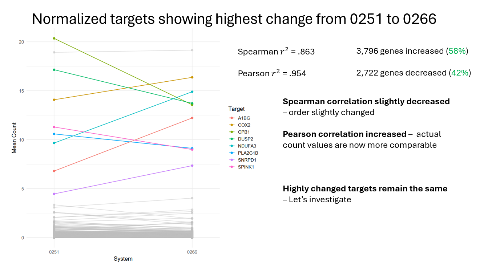
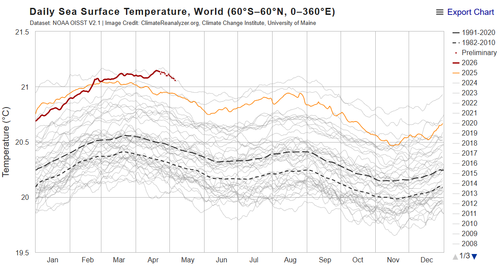

## Spaghetti Plots

Spaghetti plots are very basic, yet extremely useful plots that typically consist of a scatter plot with colored lines denoting specific groups. The colored lines facilitate intuitive differentiation and tracking of simultaneous changes of specific data groups.

In the medical field, spaghetti plots are typically used to visualize patient response to treatment when data points pre and post treatment for specific patients are available.

The following plot is an example from a [publication](https://www.researchgate.net/publication/339864303_Experiences_of_gamified_and_automated_virtual_reality_exposure_therapy_for_spider_phobia_Qualitative_studypdf) about virtual reality exposure therapy for spider phobia.



In this case, two different measurements (BAT and FSQ) related to arachnophobia are displayed side by side, with a data point for pre and a data point for post conditions for each patient. A colored line unique to each patient connects the pre and post data points. The same color is used in both plots, making it easy to track a specific patient's response to treatment in both measurements.

Notably, the scales of each measurement differ greatly, but the nature and layout of the plots allow visual comparisons of change to be quickly and easily made.

## My Spaghetti Plot

I recently used a spaghetti plot as part of a lab meeting presentation. My lab currently has two CosMx Spatial Molecular Imager (SMI) systems, after Bruker provided a loaner for us to use due to our original system performing sub optimally.

The CosMx SMI is a single-cell level spatial transcriptomics and proteomics system which uses fluorescent imaging to detect the spatial location and quantity of RNA probes or protein antibodies on a thin slice of tissue placed on a glass slide. In this case, we ran the exact same Tissue Morphology Array (TMA) slide on both systems, which contains a variety of pancreatic cancer tissue and normal tissue. We used the 6k RNA panel, and the resulting data is comprised of the counts of \~6,000 unique genes in each cell, as well as their spatial position.

My goal for part of the presentation was to showcase the performance difference between the two systems using these two slides, as well as potential normalization strategies to allow data to be combined and analyzed across systems. One of the plots I used for this was a spaghetti plot of each gene's mean expression for the entire TMA across systems before and after normalization.

Here are the relevant slides from the presentation:





When creating these plots, I used two neat tricks that I learned in this class so far:

-   The upper limit of visually differentiable colors is \~8

-   Highlight most important data points while still showing all data

I calculated the deltas in mean expression between systems for each target, selected the 8 highest deltas and highlighted those in color while displaying all \~6,000 other targets in grey.

This visual strategy elucidated the insights that the most changed targets are generally unusually highly expressed targets in both systems, and that the upward trend is nearly universal in the raw data.

It also made the much more even upward to downward trend ratio post-normalization easily visible.

These plots helped me achieve my goal of showing that while the new system performs much better, the data from the old system is still in excellent agreement with data from the new system. This made my PI happy, who had been concerned that all the data we collected on the old system was useless due to the sub optimal performance.

## Method

In order to wrangle the data into a favorable format and create the plots, I took the following steps:

1.  Combine CosMx flat files into two separate SpatialFeatureExperiment objects using the Voyager R package

2.  Extract the counts matrix from each object as a sparse matrix

3.  Take the rowMeans() of each row to get global target mean

4.  Add a system identifier and create a dataframe with both target means

5.  Pivot wider by system, take the deltas, select top 8 targets and pull their names

6.  Filter out the top 8 by name from dataframe from step 4 as a separate dataframe

7.  Plot both dataframes together using geom_point and geom_line, only coloring the top 8 dataframe.

8.  Normalize data and repeat steps 2-7 with normalized counts

Since the SpatialFeatureExperiment objects are gigantic, I will include the code for those using eval:false so it doesn't actually run, and I will run the actual code from the mean count dataframes, which are tiny.

```{r}
#load packages

library(tidyverse)
library(Voyager)
library(Matrix)
library(here)

```

```{r}
#| eval: false

# Following code is not meant to run as explained above

# Modify to work with CosMx data using flat files format

dir_use <- file.path("directory to folder containing all flat files")

list.files(dir_use)

# new tma

sfe_newtma <- readCosMX(dir_use, add_molecules = F)

# do same for old tma: sfe_oldtma

# pull counts and combine means

old_means <- Matrix::rowMeans(counts(sfe_oldtma))

old_means <- data.frame(
  target = names(old_means),
  mean_count = as.numeric(old_means),
  system = "0251"
)

new_means <- Matrix::rowMeans(counts(sfe_newtma))

new_means <- data.frame(
  target = names(new_means),
  mean_count = as.numeric(new_means),
  system = "0266"
)

#  join

both_means <- bind_rows(old_means, new_means)

# save object

saveRDS(both_means, file = "both_means.rds")

```

```{r}

# This is the code that will actually run

# beginning from the both_means dataframe

both_means <- readRDS(here("data/both_means.rds"))

# let's color the genes with the highest delta and grey out the rest

means_wide <- both_means %>%
  pivot_wider(
    names_from = system,
    values_from = mean_count
  )

delta <- means_wide %>% 
  mutate(delta = `0266` - `0251`)

top_8_delta <- delta %>% arrange(desc(delta)) %>% slice_head(n = 8) %>% .$target

both_means_top8 <- filter(both_means, target %in% top_8_delta)

# now plot

ggplot() +
  geom_point(data = both_means, aes( x = system, y = mean_count, group = target), color = "grey", alpha = .5) +
  geom_line(data = both_means, aes( x = system, y = mean_count, group = target), color = "grey", alpha = .5) + 
  geom_point(data = both_means_top8, aes( x = system, y = mean_count, group = target, color = target)) +
  geom_line(data = both_means_top8, aes( x = system, y = mean_count, group = target, color = target)) + 
  theme_minimal(base_size = 14) +
  scale_x_discrete(expand = expansion(mult = c(0.2, 0.2))) +
  labs(x = "System",
       y = "Mean Count",
       color = "Target")

```

To make the normalized count plot, simply normalize the data and plot again in the same way. Here is the code I used to normalize the data (It won't run since the data objects are huge):

```{r}
#| eval: FALSE

sfe_newtmaqc <- sfe_newtma[,sfe_newtma$nCount_RNA > 50 & sfe_newtma$Area < 30000]

sfe_oldtmaqc <- sfe_oldtma[,sfe_oldtma$nCount_RNA > 50 & sfe_oldtma$Area < 30000]

# normalize to a cell's total counts 

cts <- counts(sfe_newtmaqc)

lib_size <- colSums(cts)
scale_factor <- 845 / lib_size

norm <- t(t(cts) * scale_factor)

assay(sfe_newtmaqc, "normcounts") <- norm

summary(colSums(norm))

# all cells have the same total count now

# repeat for old tma

cts <- counts(sfe_oldtmaqc)

lib_size <- colSums(cts)
scale_factor <- 845 / lib_size

norm <- t(t(cts) * scale_factor)

assay(sfe_oldtmaqc, "normcounts") <- norm

summary(colSums(norm))

# Mean was 1095 for newtma and 593.7 for old tma, let's meet in the middle at 845

# all cells got basically scaled to having 845 total counts. Let's see the agreement between systems.

# gonna copy paste the delta plot from earlier and recreate

old_means <- Matrix::rowMeans(normcounts(sfe_oldtmaqc))

old_means <- data.frame(
  target = names(old_means),
  mean_count = as.numeric(old_means),
  system = "0251"
)

new_means <- Matrix::rowMeans(normcounts(sfe_newtmaqc))

new_means <- data.frame(
  target = names(new_means),
  mean_count = as.numeric(new_means),
  system = "0266"
)

#  join

both_means <- bind_rows(old_means, new_means)

ggplot(both_means, aes( x = system, y = mean_count, group = target)) +
  geom_point() +
  geom_line() + 
  theme_minimal()

# let's color the genes with the highest delta and grey out the rest

means_wide <- both_means %>%
  pivot_wider(
    names_from = system,
    values_from = mean_count
  )

delta <- means_wide %>% 
  mutate(delta = `0266` - `0251`)

top_8_delta <- delta %>% arrange(desc(delta)) %>% slice_head(n = 8) %>% .$target

both_means_top8 <- filter(both_means, target %in% top_8_delta)

# now plot

ggplot() +
  geom_point(data = both_means, aes( x = system, y = mean_count, group = target), color = "grey", alpha = .5) +
  geom_line(data = both_means, aes( x = system, y = mean_count, group = target), color = "grey", alpha = .5) + 
  geom_point(data = both_means_top8, aes( x = system, y = mean_count, group = target, color = target)) +
  geom_line(data = both_means_top8, aes( x = system, y = mean_count, group = target, color = target)) + 
  theme_minimal(base_size = 14) +
  scale_x_discrete(expand = expansion(mult = c(0.2, 0.2))) +
  labs(x = "System",
       y = "Mean Count",
       color = "Target")


```

## Spaghetti Variations

The term "spaghetti plot" actually encompasses quite a vast array of different plot types, and the feature that they all share in common is essentially colored lines corresponding to certain groups that connect data points in a shared scale.

Another common configuration you will find, for example, is climate data showing seasonal trends over the course of the year with different years corresponding to different colors.

[This](https://climatereanalyzer.org/clim/sst_daily/?dm_id=world2) is an example of an interactive spaghetti plot of daily sea surface temperatures. Here is a snapshot of the plot:


