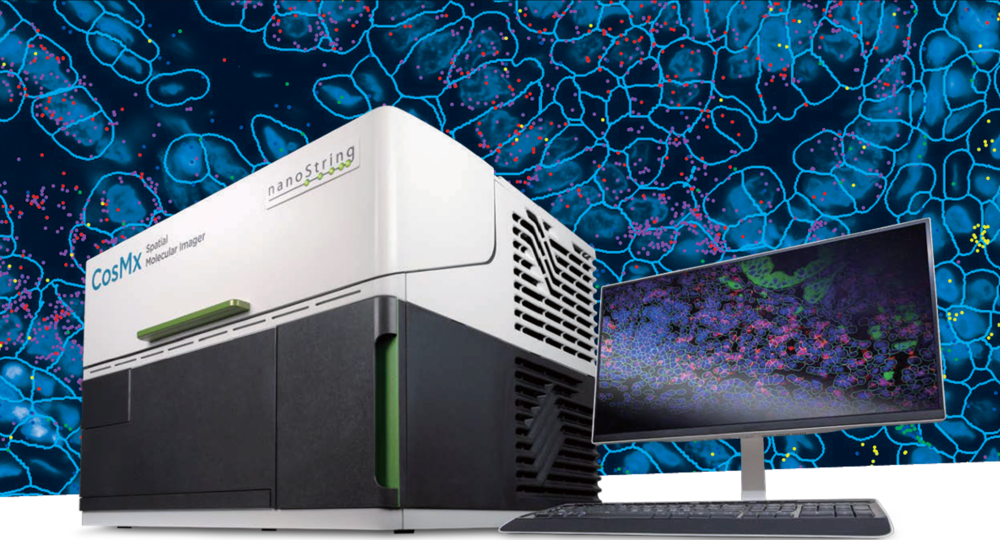
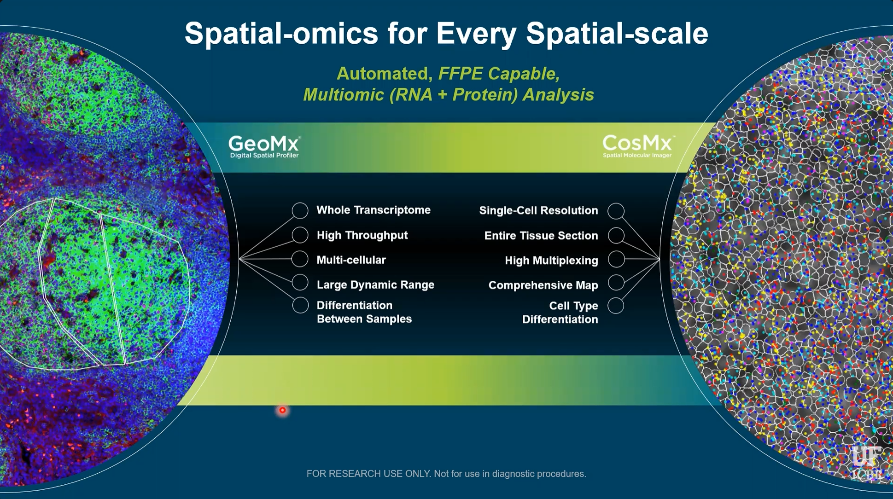

## CosMx Spatial Molecular Imager



The CosMx Spatial Molecular Imager is a cutting-edge single-cell spatial transcriptomics and proteomics platform developed by Nanostring and later acquired by Bruker Spatial Biology. Its defining feature is the ability to detect whole transcriptome level (18,000+ plex) of RNA transcripts at subcellular resolution using cyclic in-situ hybridization of photocleavable fluorescent probe barcodes paired with digital imaging. Protein data can also be acquired, though only up to 64-plex currently.

The platform uses a fluorescent membrane marker to segment the cells by drawing polygons around their boundaries, then assigns the transcript counts to their respective cells. In the resulting data object, each cell contains its polygon geometry; the counts of each transcript detected within it; and any associated metadata. The subcellular X-Y coordinates of each individual transcript can be optionally included as seen in the image above, though that can result in a tremendously large data object.

Nanostring had been a pioneer in the field of spatial biology with the earlier development of the GeoMx Digital Spatial Profiler platform, which is still widely used today. This platform uses photocleavable oligonucleotide barcoding of antibodies to achieve simultaneous detection of 80+ protein targets, a massive leap from the upper limit of less than 10 which can be achieved in one round of antibody incubation through traditional immunofluorescent imaging techniques. 

## CosMx vs GeoMx



The main difference between these platforms, particularly in terms of data collection and analysis strategies, is that GeoMx uses fluorescent imaging to guide the selection of data collection regions, but the actual x-y coordinates of the RNA/Protein data within that region are not known. The data is thus similar to bulk techniques that measure an aggregate of cells, and cannot distinguish between them. GeoMx does, however, allow for the precise selection of regions, so that the collection of cells being measured is biologically informative to the researcher's interest. CosMx, in contrast, collects data of each specific cell and thus does not require such planning and foresight during data collection. In the image above, three manually drawn GeoMx collection regions guided by fluorescent staining can be seen on the left, compared to CosMx cell boundaries and subcellular transcripts seen on the right.

Because of its more intentional approach, GeoMx data analysis is generally quite straightforward. It can typically consist of differential gene/protein expression between groups of regions, followed by pathway enrichment analysis. The most common approach when planning a GeoMx experiment is essentially to ask: How is this region different than that region? The goal of the analysis in this case is to simply answer that question.

CosMx, on the other hand, is much more geared towards exploration. Comprehensive data is collected on every gene in every cell, and then through exploratory data analysis, interesting insights can be discovered and cause the "question" to reveal itself. Sounds cool and exciting, but it raises one major problem: The monstrous size of the data, intense computation requirement, and lack of intuitive analysis tools cause the researchers to become overwhelmed and paralyzed. I have seen this problem time and time again.

Millions of transcripts across tens of thousands of cells drown biological meaning in an ocean of noise. Analysts possess the ability to isolate meaningful cells to investigate, but lack the biological knowledge to do so. Researchers possess the biological knowledge of which cells should be investigated, but lack the analytic ability to do so. 

My goal is to give them that ability.

## Basic CosMx Explorer Tool

This tool essentially provides a simple and intuitive GeoMx-inspired analysis workflow, while maintaining a key advantage of single-cell resolution data: Cell Typing.

Navigate a plot of cell polygons colored by cell type, and draw a region of interest (ROI) using the polygon or rectangle tool. The right side will subsequently show the cell count and proportion of cells of each type within the two most recently selected regions.

The current state is obviously an extremely rudimentary tool, serving primarily as a foundation and proof-of-concept.

My tentative goal for this tool is to allow the user to perform pseudobulk differential expression and pathway analysis between those two regions, as well as to name the regions and download the subset of the data corresponding to those cells to help guide further analysis.

I plan to include the ability to overlay the map on immunofluorescence or H&E images of the tissue.

It would also be cool to allow the user to group regions together and perform further analysis on various combinations of those groups, if the logistics of that are not too insanely complicated.

<iframe
  src="https://psn9q0-gabriel-zangirolani.shinyapps.io/simpleshinyapp/"
  width="100%"
  height="850"
  style="border:none;">
</iframe>

## References

The data used above is the publicly avaible CosMx Human Pancreas WTX FFPE Dataset, available [here](https://brukerspatialbiology.com/products/cosmx-spatial-molecular-imager/ffpe-dataset/cosmx-smi-human-pancreas-ffpe-dataset/).


## Methods

Here is an overview of the preparation of cosmx data and transformation into an interactive shiny application.

These are the packages that were used


```{r}
#| eval: false

library(tidyverse)
library(leaflet)
library(sf)
library(here)
library(Seurat)
library(SeuratObject)
library(shiny)

```

We first begin by loading the Seurat object from the aforementioned public dataset and adding the provided cell type annotations

```{r}
#| eval: false

panc <- readRDS(file = here("data/Seurat_Pancreas_withTranscripts.rds"))

meta <- readRDS(here("data/Pancreas_celltype_InSituType.rds"))
panc@meta.data$types <- meta[rownames(panc@meta.data), "cell_types"]
panc@meta.data$types[is.na(panc@meta.data$types)] <- "QC_dropped"

# Update seurat object and drop cells that failed nanostring's QC

keep <- meta$cell_ID

panc <- panc[, keep]

panc_updated <- UpdateSeuratObject(panc)

saveRDS(panc_updated, file = here("data/panc_updated.rds"))

panc <- subset(panc_updated, subset = types != "QC_dropped")


```


Now we will remove the cell ids and polygons and convert it to an sf object

```{r}
#| eval: false

img <- panc@images[[1]]

seg <- img@boundaries$segmentation

# add cell types

sf_obj$cell_type <- panc@meta.data$types

```

Now we're ready to use this object with the shiny app. Let's generate a global color palette based on cell types.

```{r}
#| eval: false

cell_types <- sort(unique(sf_obj$cell_type))

pal <- colorFactor(
  palette = "Set3",
  domain = sf_obj$cell_types
)

cell_colors <- setNames(
  pal(cell_types),
  cell_types
)

```


Define a simple user interface

```{r}
#| eval: false

ui <- fluidPage(
  
  fluidRow(
    
    column(
      width = 9,
      leafletOutput("map", height = 900)
    ),
    
    column(
      width = 2,
      
      "ROI 1 Cell count:",
      
      textOutput("selected1", inline = T),
      
      plotOutput("stratified1")
    ),
    
    column(
      width = 2,
      
      "ROI 2 Cell count:",
      
      textOutput("selected2", inline = T),
      
      plotOutput("stratified2")
    ),
    
  )
)

```

Create the shiny app that generates the interactive leaflet plot and subsequent cell type stratification plots after user selects two regions of interest

```{r}
#| eval: false

server <- function(input, output, session) {
  
  output$map <- renderLeaflet({
    leaflet(sf_obj) %>%
      addPolygons(
        fillColor = ~pal(cell_type),
        weight = 0.2,
        fillOpacity = 0.7
      ) %>%
      addLegend(
        pal = pal,
        values = ~cell_type,
        title = "Cell Type"
      ) %>%
      addDrawToolbar(
        targetGroup = "roi",
        polygonOptions = drawPolygonOptions(),
        rectangleOptions = drawRectangleOptions(),
        editOptions = editToolbarOptions(),
        polylineOptions = FALSE,
        markerOptions = FALSE,
        circleMarkerOptions = FALSE,
        circleOptions = FALSE
      )
    
  })
  
  rois <- reactiveValues(list = list())
  
  observeEvent(input$map_draw_new_feature, {
    
    roi <- input$map_draw_new_feature %>% 
      
      jsonlite::toJSON(auto_unbox = TRUE) %>% 
      
      geojsonio::geojson_sf()
    
    st_crs(roi) <- st_crs(sf_obj)
    
    idx <- length(rois$list) + 1
    rois$list[[idx]] <- roi
    
  })
  
  last_two_rois <- reactive({
    
    req(length(rois$list) >= 2)
    
    tail(rois$list, 2)
  })
  
  roi_table <- function(roi) {
    
    cells <- sf_obj[lengths(st_intersects(sf_obj, roi)) > 0, ]
    
    df <- as.data.frame(prop.table(table(cells$cell_type)))
    colnames(df) <- c("cell_type", "prop")
    
    df
  }
  
  output$selected1 <- renderText({
    
    cells <- sf_obj[lengths(st_intersects(sf_obj, last_two_rois()[[1]])) > 0, ]
    
    nrow(cells)
    
  })
  
  output$selected2 <- renderText({
    
    cells <- sf_obj[lengths(st_intersects(sf_obj, last_two_rois()[[2]])) > 0, ]
    
    nrow(cells)
    
  })

  output$stratified1 <- renderPlot({
    
    roi <- last_two_rois()[[1]]
    
    df <- roi_table(roi)
    
    ggplot(df, aes(x = "", y = prop, fill = cell_type)) +
      geom_col(width = 1, alpha = .7) +
      scale_y_continuous(labels = scales::percent_format()) +
      labs(x = NULL, y = "Proportion", fill = "Cell Type") +
      scale_fill_manual(values = cell_colors) +
      theme_minimal()
    
  })
  
  output$stratified2 <- renderPlot({
    
    roi <- last_two_rois()[[2]]
    
    df <- roi_table(roi)
    
    ggplot(df, aes(x = "", y = prop, fill = cell_type)) +
      geom_col(width = 1, alpha = .7) +
      scale_y_continuous(labels = scales::percent_format()) +
      labs(x = NULL, y = "Proportion", fill = "Cell Type") +
      scale_fill_manual(values = cell_colors) +
      theme_minimal()
    
  })
  
}


```


That's it! Now just run and deploy the shiny app

```{r}
#| eval: false

shinyApp(ui, server)

```


